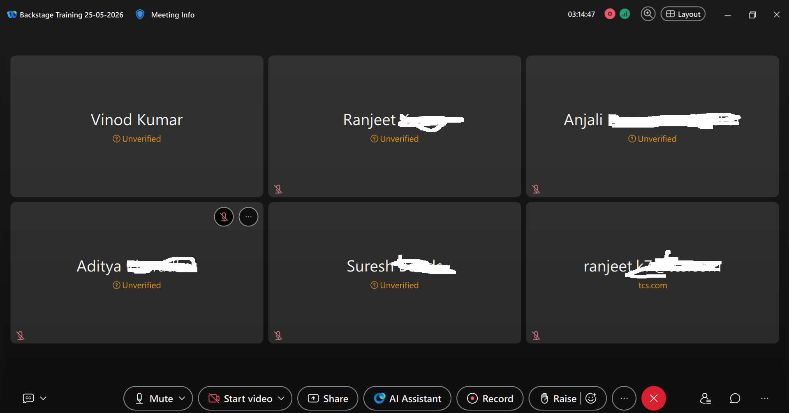

# Platform Engineering with Backstage, AWS, Kubernetes & Terraform (TCS-TimesGroup-EduArn)



[EduArn.com](https://eduarn.com/eduarn-lms)

## Training Demo Video
[Platform Engineering Training Video](https://youtube.com/shorts/Oj9Rw4q1RBE)


---

# Overview

This repository contains the complete material, labs, documentation, templates, and hands-on exercises for the **10-Day Platform Engineering Training Program**.

The program is designed to help participants understand and implement a modern **Internal Developer Platform (IDP)** using:

* Backstage
* AWS
* Kubernetes
* Terraform
* CI/CD
* TechDocs
* Governance & Observability

The training focuses on **infrastructure self-service**, **golden paths**, and **platform engineering operating models** used in modern enterprise environments.

---

# Training Objectives

By the end of the training, participants will be able to:

* Understand platform engineering concepts and architecture
* Build and manage a Backstage developer portal
* Create software catalog entities and ownership models
* Develop self-service workflows using Backstage Scaffolder
* Publish and maintain TechDocs documentation
* Provision AWS infrastructure using Terraform
* Understand Kubernetes fundamentals and EKS integration
* Build CI/CD-driven infrastructure automation
* Implement governance and observability practices
* Deliver a complete end-to-end Internal Developer Platform

---

# Training Delivery Model

The training is delivered using:

* Instructor-led sessions
* Hands-on labs
* Guided demos
* Real-world architecture walkthroughs
* Capstone implementation project
* Platform engineering reference implementation

---

# Participant Delivery Approach

## Training Material Delivery

Participants will receive:

* Git repository access
* Lab guides
* Sample templates
* Terraform examples
* Backstage configurations
* TechDocs documentation
* Architecture diagrams
* CI/CD pipeline samples

---

## Delivery Methods

### Option 1 — Local Developer Machine

Participants run:

* Backstage locally
* Terraform locally
* Docker locally
* Kubernetes tooling locally

Recommended for:

* Full hands-on experience
* Developer-focused environments

---

### Option 2 — AWS EC2 Hosted Environment

If participant systems face:

* Firewall restrictions
* Corporate proxy limitations
* Installation restrictions
* Limited permissions

Then a centralized AWS EC2 training environment will be provided.

Participants will access:

* Shared Backstage environment
* Pre-configured AWS tooling
* Terraform environment
* Kubernetes access
* Git repositories

---

# Repository Structure

```text id="7z2l0d"
platform-engineering-training/
├── docs/
├── labs/
├── templates/
├── terraform/
├── backstage/
├── kubernetes/
├── ci-cd/
├── architecture/
├── examples/
├── README.md
└── mkdocs.yml
```

---

# 10-Day Training Plan

---

# Day 1 — Foundations of Platform Engineering

## Topics

* Evolution from DevOps to Platform Engineering
* Internal Developer Platforms (IDP)
* Self-service infrastructure concepts
* Platform architecture overview
* Control plane vs execution plane
* Role of Backstage, Terraform, AWS, and Kubernetes

## Hands-on

* Environment setup
* Git, Docker, Node.js installation
* AWS access validation
* Architecture walkthrough
* Golden path understanding

## Outcome

Participants understand platform engineering fundamentals and how modern infrastructure self-service platforms operate.

---

# Day 2 — Backstage Fundamentals

## Topics

* Introduction to Backstage
* Backstage architecture
* Core components
* Deployment models
* Backstage as a platform control plane

## Hands-on

* Local Backstage setup
* Running developer portal locally
* Exploring configuration and plugins

## Outcome

Participants can deploy and operate Backstage locally.

---

# Day 3 — Backstage Software Catalog

## Topics

* Catalog concepts
* Entity models
* catalog-info.yaml
* Ownership and metadata
* Dependency mapping

## Hands-on

* Create catalog entities
* Register services/resources
* Add ownership metadata

## Outcome

Participants can model services and infrastructure resources in Backstage.

---

# Day 4 — Backstage Scaffolder & Templates

## Topics

* Scaffolder architecture
* Templates and parameters
* Git integrations
* Golden path workflows

## Hands-on

* Create custom templates
* Automate repository generation
* Register generated components

## Outcome

Participants can build self-service provisioning workflows.

---

# Day 5 — Plugins, TechDocs & Developer Experience

## Topics

* Plugin architecture
* Kubernetes plugin
* CI/CD integrations
* TechDocs and MkDocs
* Documentation workflows

## Hands-on

* Install plugins
* Publish TechDocs
* Create onboarding documentation

## Outcome

Participants improve developer experience and service visibility.

---

# Day 6 — AWS for Platform Engineering

## Topics

* AWS core services
* IAM
* EC2
* VPC
* EKS
* S3 and DynamoDB
* Platform networking basics

## Hands-on

* Create VPC
* Launch EC2
* Configure IAM
* Prepare Terraform backend

## Outcome

Participants understand AWS foundational infrastructure.

---

# Day 7 — Kubernetes Basics for Platform Engineering

## Topics

* Kubernetes fundamentals
* Cluster architecture
* Pods, deployments, namespaces
* EKS concepts
* Backstage Kubernetes integration

## Hands-on

* Install kubectl
* Explore cluster objects
* Review manifests

## Outcome

Participants understand Kubernetes runtime concepts.

---

# Day 8 — Terraform Fundamentals

## Topics

* Infrastructure as Code
* Terraform workflow
* Providers and resources
* Variables and outputs
* Modules and state management

## Hands-on

* Install Terraform
* Build infrastructure
* Create reusable modules

## Outcome

Participants can provision AWS infrastructure using Terraform.

---

# Day 9 — Terraform + CI/CD + Integration

## Topics

* Remote state management
* GitOps concepts
* CI/CD integration
* Backstage + Terraform automation
* Infrastructure workflows

## Hands-on

* GitHub Actions/Jenkins pipelines
* Trigger provisioning from Backstage
* Validate automation flow

## Outcome

Participants build end-to-end infrastructure automation pipelines.

---

# Day 10 — Governance, Observability & Capstone

## Topics

* RBAC
* OPA Policy as Code
* Monitoring and logging
* Cost optimization
* Platform governance
* Enterprise operating models

## Hands-on

* Complete IDP implementation
* Provision infrastructure
* Apply governance controls
* Final platform demo

## Outcome

Participants deliver a production-aligned platform engineering solution.

---

# Tools & Technologies

| Category               | Technologies             |
| ---------------------- | ------------------------ |
| Developer Portal       | Backstage                |
| Cloud                  | AWS                      |
| Container Platform     | Kubernetes / EKS         |
| Infrastructure as Code | Terraform                |
| CI/CD                  | GitHub Actions / Jenkins |
| Documentation          | TechDocs / MkDocs        |
| Containerization       | Docker                   |

---

# Prerequisites

Participants should have:

* Basic Linux knowledge
* Basic cloud understanding
* Familiarity with Git
* Understanding of DevOps concepts

---

# Local Setup Requirements

Install:

* Git
* Docker
* Node.js
* Python 3
* Terraform
* kubectl
* AWS CLI

---

# Running TechDocs Locally

## Create Virtual Environment

```bash id="8z1m8f"
python3 -m venv venv
source venv/bin/activate
```

## Install Dependencies

```bash id="2qdf0y"
pip install mkdocs-techdocs-core
```

## Run Documentation

```bash id="2mjlwm"
mkdocs serve
```

Open:

```text id="z4kjlwm"
http://127.0.0.1:8000
```

---

# Certification & Completion

Participants completing all labs and capstone exercises will receive:

* Course completion acknowledgment
* Platform engineering implementation experience
* End-to-end IDP exposure

---

# Support

For lab issues or environment support:

* Training support team
* Platform engineering instructors
* Shared collaboration channels

---

# License

This training content is intended for educational and enterprise training purposes.

